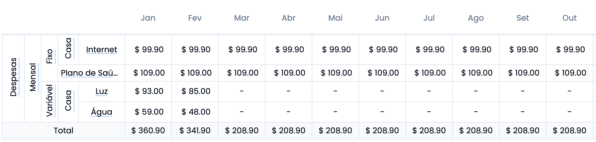

# Grupos e Categorias

O FlyCash oferece uma maneira inteligente e flexível de organizar suas finanças, permitindo que você visualize claramente a origem e o destino do seu dinheiro.

### **O que são Grupos?**

Grupos são grandes divisões que representam as **fontes de entrada e saída de dinheiro**. Isso ajuda a categorizar seus registros de forma geral. Exemplos de Grupos:
- **Gastos**: Todas as despesas, como contas e compras.
- **Receitas**: Entradas de dinheiro, como salário e rendas extras.
- **Investimentos**: Aplicações financeiras, como poupança, ações e fundos.

Grupos ajudam você a responder perguntas como:
- Quanto estou gastando em comparação com o que ganho?
- Quanto dinheiro está sendo destinado a investimentos?

---

### **O que são Categorias?**
Categorias são subdivisões dentro de um grupo. Elas permitem detalhar melhor suas transações. Por exemplo:

  <ul style="width: 300px">
    <li>Grupo: <b>Gastos</b></li>
    <li>Categoria: <b>Casa</b></li>
    <ul>
      <li>Subcategoria: <b>Luz</b>, <b>Água</b>, <b>Internet</b></li>
    </ul>
    <li>Categoria: <b>Transporte</b></li>
    <li>Categoria: <b>Lazer</b></li>
    <li>Categoria: <b>Receitas</b></li>
  </ul>
  <table>
    <tr>
      <th>Grupo</th>
      <th>Categoria</th>
      <th>Subcategoria</th>
    </tr>
    <tr>
      <td rowspan="5">Gastos</td>
      <td rowspan="3">Casa</td>
      <td>Luz</td>
    </tr>
    <tr>
      <td>Água</td>
    </tr>
    <tr>
      <td>Internet</td>
    </tr>
    <tr>
      <td colspan="2">Transporte</td>
    </tr>
    <tr>
      <td colspan="2">Lazer</td>
    </tr>
  </table>

  <ul style="width: 300px">
    <li>Grupo: <b>Receitas</b></li>
    <li>Categoria: <b>Salário</b></li>
    <ul>
      <li>Subcategoria: <b>1a quinzena</b>, <b>2a quinzena</b>, <b>Freelance</b>, <b>Rendimentos de aluguel</b></li>
    </ul>
    <li>Categoria: <b>Investimentos</b></li>
  </ul>
  <table>
    <tr>
      <th>Grupo</th>
      <th>Categoria</th>
      <th>Subcategoria</th>
    </tr>
    <tr>
      <td rowspan="3">Receitas</td>
      <td rowspan="2">Salário</td>
      <td>1a quinzena</td>
    </tr>
    <tr>
      <td >2a quinzena</td>
    </tr>
    <tr>
      <td>Frelance</td>
      <td>Rendimentos de aluguel</td>
    </tr>
  </table>

  <ul style="width: 300px">
    <li>Grupo: <b>Investimentos</b></li>
    <li>Categoria: <b>Ações</b></li>
    <li>Categoria: <b>Poupança</b></li>
    <li>Categoria: <b>Tesouro Direto</b></li>
  </ul>
  <table>
    <tr>
      <th>Grupo</th>
      <th>Categoria</th>
    </tr>
    <tr>
      <td rowspan="3">Investimentos</td>
      <td>Ações</td>
    </tr>
    <tr>
      <td >Poupança</td>
    </tr>
    <tr>
      <td>Tesouro Direto</td>
    </tr>
  </table>

Dessa forma, você pode entender com clareza:
- Para onde o dinheiro está indo dentro dos gastos.
- De onde suas receitas estão vindo.
- Quais tipos de investimentos estão recebendo mais aportes.

