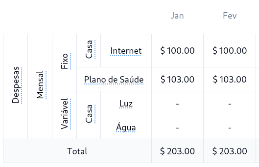
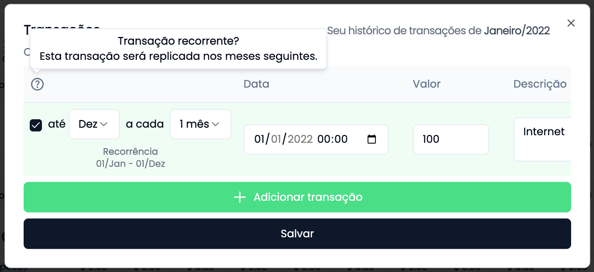
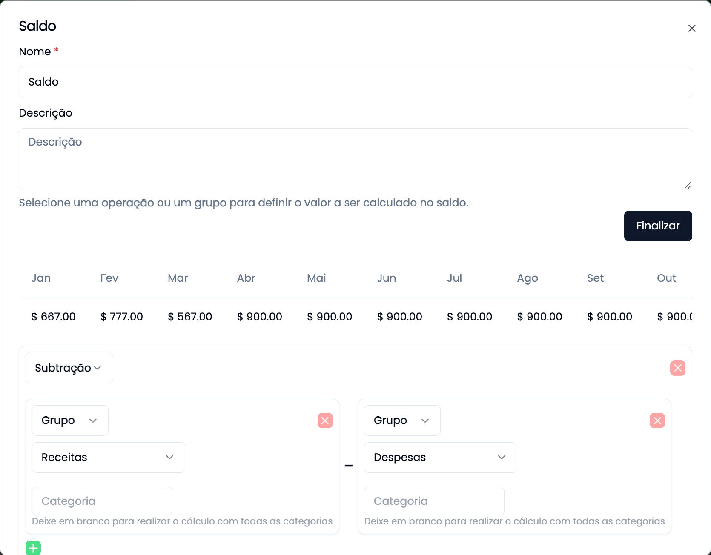
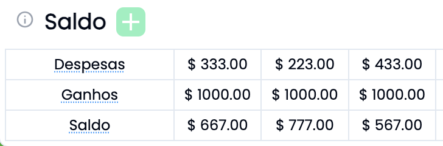
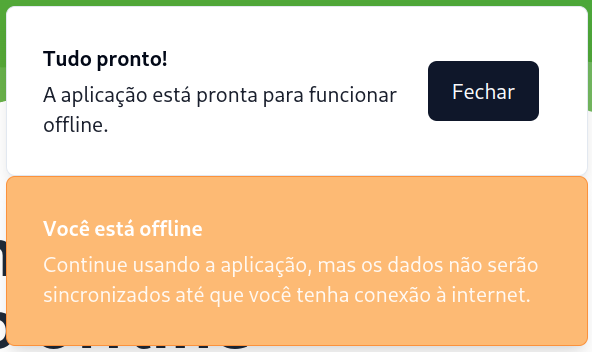

# Funcionalidades do FlyCash

Explore os recursos poderosos do FlyCash que ajudam você a gerenciar suas finanças de forma simples e eficiente. Seja você um leitor ou um aprendiz visual, temos tudo o que você precisa para dominar o aplicativo!

## 📂 Organização por Grupos e Categorias

### **O que são Grupos e Categorias?**
Grupos e categorias são a base da organização no FlyCash. Eles permitem que você classifique suas transações de forma clara e intuitiva.

#### **Exemplo Prático:**
1. Crie um grupo chamado **Gastos**.
2. Adicione categorias como **Casa**, **Transporte** e **Lazer**.
3. Dentro de **Casa**, crie subcategorias como **Luz**, **Água** e **Internet**.

#### **Por que usar?**
- Visualize claramente para onde seu dinheiro está indo.
- Identifique áreas onde você pode economizar.

<!-- [Assista ao vídeo tutorial](#)   -->
[Leia o guia completo sobre Grupos e Categorias](/features/groups-and-categories)

## 🔁 Transações Recorrentes

### **O que são Transações Recorrentes?**
Transações recorrentes são movimentações que se repetem em intervalos regulares, como contas mensais ou salários.

#### **Como configurar:**
1. Marque uma transação como **recorrente**.
2. Defina a frequência (ex.: mensal) e o período de duração.
3. O FlyCash cria automaticamente as transações futuras.

#### **Gerenciamento Flexível:**
- **Editar:** Altere uma transação e escolha se a mudança afeta todas as recorrências ou apenas algumas.
- **Excluir:** Remova uma única transação ou toda a série de recorrências.

<!-- [Assista ao vídeo tutorial](#)   -->
[Leia o guia completo sobre Transações Recorrentes](/features/transactions-recurrences)

## 📊 Visualização de Saldos

### **O que são Saldos Personalizados?**
Saldos permitem que você faça cálculos personalizados entre grupos, categorias ou subcategorias.

#### **Exemplo Prático:**
1. Crie um saldo chamado **Economia Mensal**.
2. Some todas as suas **Receitas** e subtraia os **Gastos**.
3. Acompanhe quanto você está economizando a cada mês.

#### **Benefícios:**
- Entenda melhor sua saúde financeira.
- Tome decisões informadas com base em dados claros.

<!-- [Assista ao vídeo tutorial](#)   -->
[Leia o guia completo sobre Visualização de Saldos](/features/balances)

## 🌐 Funcionalidade Offline

### **O que é o Modo Offline?**
O FlyCash funciona mesmo sem conexão com a internet, permitindo que você acesse e gerencie suas finanças em qualquer lugar.

#### **Como usar:**
1. Faça login **pelo menos uma vez** com internet para sincronizar seus dados.
2. No plano gratuito, você pode **apenas visualizar** os dados offline.
3. No plano premium, você pode **adicionar e editar** transações offline.

#### **Benefícios:**
- Acesse suas finanças em viagens ou áreas sem conexão.
- Nunca perca o controle, mesmo quando estiver desconectado.

<!-- [Assista ao vídeo tutorial](#)   -->
[Leia o guia completo sobre Funcionalidade Offline](/features/offline)

<!--
## 🎥 Vídeos Tutoriais

Precisa de uma ajuda visual? Confira nossa playlist de vídeos tutoriais para aprender a usar o FlyCash de forma prática e rápida.

- [Como criar Grupos e Categorias](#)
- [Configurando Transações Recorrentes](#)
- [Usando Saldos Personalizados](#)
- [Funcionalidade Offline: Como funciona?](#)

-->

## 📚 Guias Detalhados

Prefere ler? Nossos guias escritos cobrem todas as funcionalidades do FlyCash em detalhes, com exemplos práticos e dicas úteis.

- [Guia Completo de Grupos e Categorias](/features/groups-and-categories)
- [Tudo sobre Transações Recorrentes](/features/transactions-recurrences)
- [Dominando a Visualização de Saldos](/features/balances)
- [Funcionalidade Offline: Tudo o que você precisa saber](/features/offline)

## 🚀 Dicas Rápidas

- Use **categorias específicas** para entender melhor seus gastos.
- Configure **transações recorrentes** para contas fixas e nunca mais se esqueça de pagá-las.
- Crie **saldos personalizados** para acompanhar metas financeiras, como economias ou investimentos.
- No modo offline, **planeje suas finanças** mesmo sem internet e sincronize depois.

---

### **Por que Escolher o FlyCash?**
- **Simplicidade:** Interface intuitiva e fácil de usar.
- **Flexibilidade:** Organize suas finanças do seu jeito.
- **Controle Total:** Acesse seus dados em qualquer lugar, online ou offline.

[Experimente Grátis 💸](https://flyca.sh)

---

### **Próximos Passos**
- [Comece agora com o FlyCash](/getting-started)
- [Explore nossos planos e preços](/plans-and-pricing)
- [Dúvidas? Consulte o FAQ](/faq)
