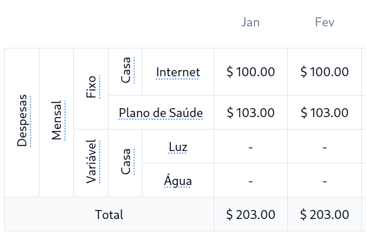
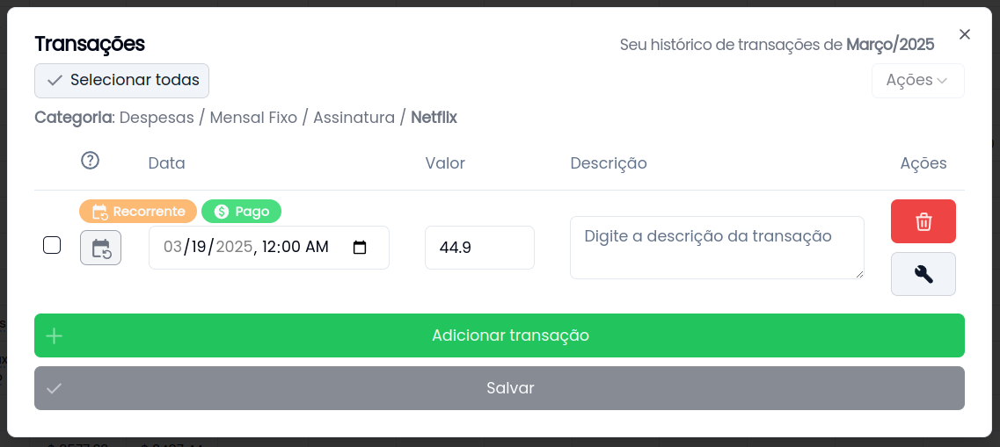
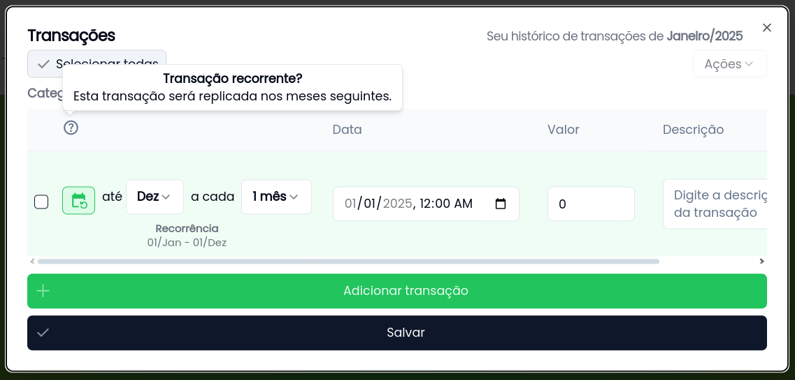
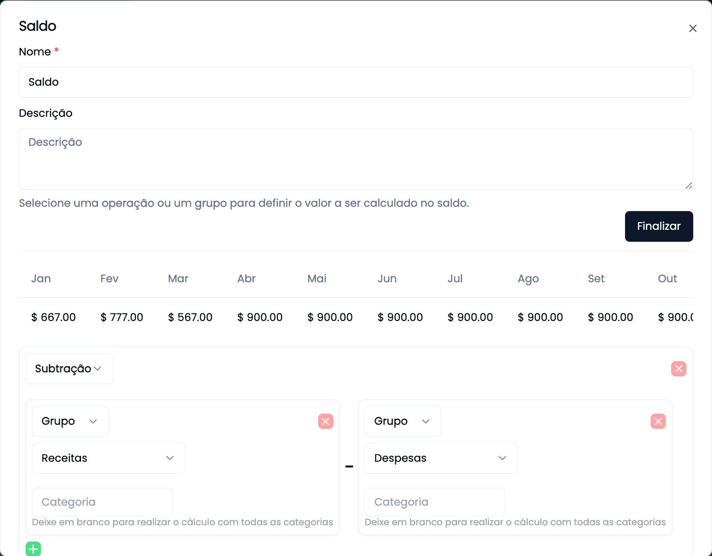
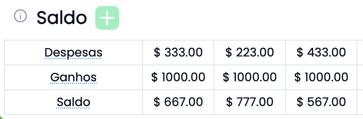

# Funcionalidades do FlyCash

Explore os recursos poderosos do FlyCash que ajudam você a gerenciar suas finanças de forma simples e eficiente. Seja você um leitor ou um aprendiz visual, temos tudo o que você precisa para dominar o aplicativo!

## 📂 Organização por Grupos e Categorias

### **O que são Grupos e Categorias?**
Grupos e categorias são a base da organização no FlyCash. Eles permitem que você classifique suas transações de forma clara e intuitiva.

#### **Exemplo Prático:**
1. Crie um grupo chamado **Gastos**.
2. Adicione categorias como **Casa**, **Transporte** e **Lazer**.
3. Dentro de **Casa**, crie subcategorias como **Luz**, **Água** e **Internet**.

#### **Por que usar?**
- Visualize claramente para onde seu dinheiro está indo.
- Identifique áreas onde você pode economizar.

[Leia o guia completo sobre Grupos e Categorias](/features/groups-and-categories)

## ✍️ Transações (Registro Manual)

### **O que são Transações?**

Transações são movimentações financeiras que você faz com seus gastos e receitas. Você pode registrá-las **manualmente** a qualquer momento.

#### **Como configurar:**
1. Selecione um mês de referência em alguma categoria.
2. Clique no botão de **Adicionar Transação**.
3. Preencha os campos de **Data**, **Valor** e opcionalmente **Descrição**.
4. Clique no botão **Salvar**.

Em cada transação você encontrará um botão de **Configuração** que permite editar o campo **Status da Transação** e **Recebimento de lembrete para pagamento**.

- **Status da Transação**: Indica se a transação está **paga** ou **pendente/atrasada**.
- **Recebimento de lembrete para pagamento**: Indica se o lembrete de pagamento deve ser enviado para o email do destinatário.
  - ℹ️ Essa opção serve apenas para informar a preferência do envio do lembrete de maneira individual. Para habilitar/desabilitar o envio de lembretes de pagamento em geral, vá em [**Meu Perfil**](https://flyca.sh/profile) > **Configurações** > **Recebimento de E-mails**.

[Leia o guia completo sobre Transações](/features/transactions)

## 📥 Importação de Faturas (PDF/OFX)

Importe a fatura do seu cartão de crédito e ganhe tempo:

- **Formatos:** PDF e OFX.
- **Categorização automática:** as transações entram com categorias sugeridas.
- **Detecção de duplicatas:** o sistema aponta compras que já existem no seu controle.
- **Parcelas:** compras parceladas são reconhecidas (ex: "3/10") e projetadas nas próximas faturas.

[Leia o guia completo de Importação](/features/import-transactions)

## 🔁 Transações Recorrentes

### **O que são Transações Recorrentes?**
Transações recorrentes são movimentações que se repetem em intervalos regulares, como contas mensais ou salários.

#### **Como configurar:**
1. Marque uma transação como **recorrente**.
2. Defina a frequência (ex.: mensal) e o período de duração.
3. O FlyCash cria automaticamente as transações futuras.

#### **Gerenciamento Flexível:**
- **Editar:** Altere uma transação e escolha se a mudança afeta todas as recorrências ou apenas algumas.
- **Excluir:** Remova uma única transação ou toda a série de recorrências.

[Leia o guia completo sobre Transações Recorrentes](/features/transactions-recurrences)

## 📊 Visualização de Saldos

### **O que são Saldos Personalizados?**
Saldos permitem que você faça cálculos personalizados entre grupos, categorias ou subcategorias.

#### **Exemplo Prático:**
1. Crie um saldo chamado **Economia Mensal**.
2. Some todas as suas **Receitas** e subtraia os **Gastos**.
3. Acompanhe quanto você está economizando a cada mês.

#### **Benefícios:**
- Entenda melhor sua saúde financeira.
- Tome decisões informadas com base em dados claros.

[Leia o guia completo sobre Visualização de Saldos](/features/balances)

## 📈 Fluxo de Caixa

Acompanhe sua saúde financeira em um só lugar:

- **Gráfico mensal:** entradas vs. saídas por mês no ano.
- **Análise por categoria:** totais e principais transações (Essencial+) e relatórios avançados com comparativo e variação (Equilíbrio Total).
- **Projeções:** saldo projetado com base na sua média mensal.
- **Exportação XLSX:** exporte suas transações e análises para Excel (Equilíbrio Total).

[Leia o guia completo do Fluxo de Caixa](/features/cashflow)

## 📚 Guias Detalhados

Prefere ler? Nossos guias escritos cobrem todas as funcionalidades do FlyCash em detalhes, com exemplos práticos e dicas úteis.

- [Guia Completo de Grupos e Categorias](/features/groups-and-categories)
- [Tudo sobre Transações](/features/transactions)
- [Tudo sobre Transações Recorrentes](/features/transactions-recurrences)
- [Dominando a Visualização de Saldos](/features/balances)
- [Importação de Faturas (PDF/OFX)](/features/import-transactions)
- [Fluxo de Caixa](/features/cashflow)

## 🚀 Dicas Rápidas

- Use **categorias específicas** para entender melhor seus gastos.
- <u>Desabilite</u> o **lembrete de pagamento** em receitas que não estão sob seu controle para evitar alarmes falsos de atrasos. Use apenas o status para acompanhar o progresso.
- Configure **transações recorrentes** para contas fixas e nunca mais se esqueça de pagá-las.
- **Importe a fatura** do cartão para economizar horas de digitação manual.
- Crie **saldos personalizados** para acompanhar metas financeiras, como economias ou investimentos.

---

### **Por que Escolher o FlyCash?**
- **Simplicidade:** Interface intuitiva e fácil de usar.
- **Flexibilidade:** Registre gastos na hora ou importe tudo de uma vez.
- **Controle Total:** Entenda para onde vai seu dinheiro com relatórios e gráficos.

[Experimente Grátis 💸](https://flyca.sh)

---

### **Próximos Passos**
- [Comece agora com o FlyCash](/getting-started)
- [Explore nossos planos e preços](/plans-and-pricing)
- [Dúvidas? Consulte o FAQ](/faq)
