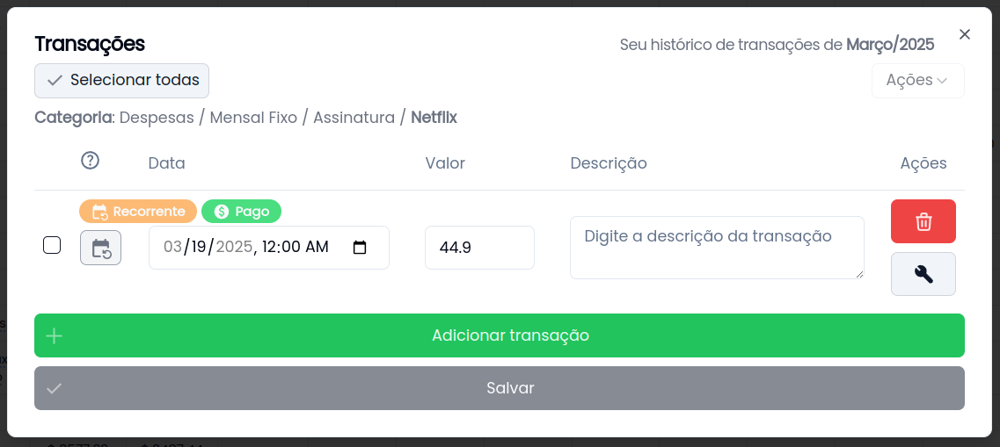
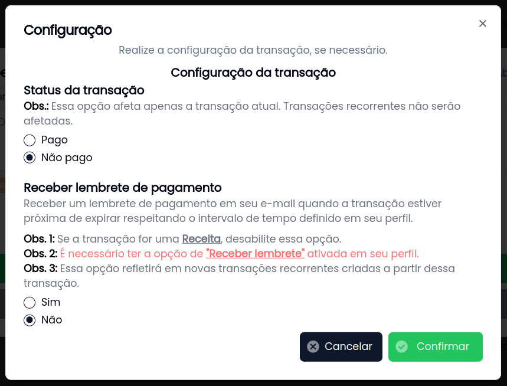
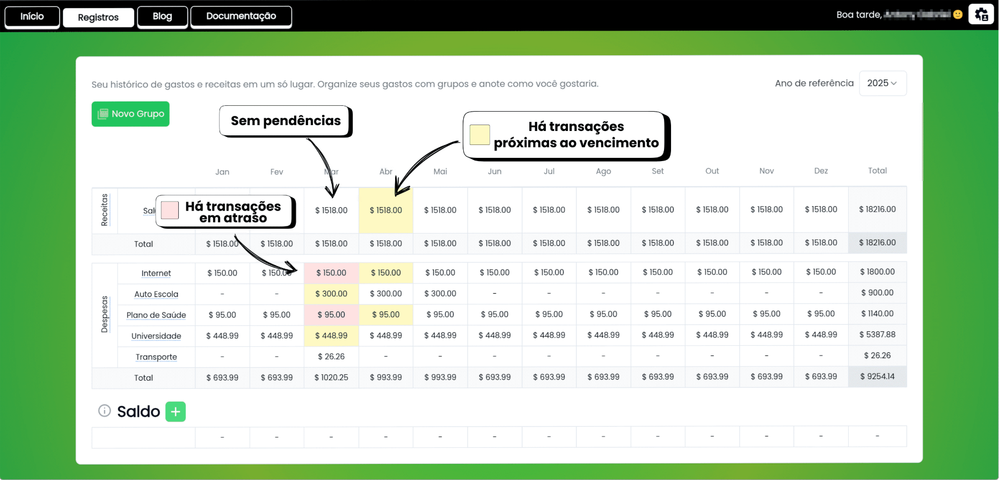
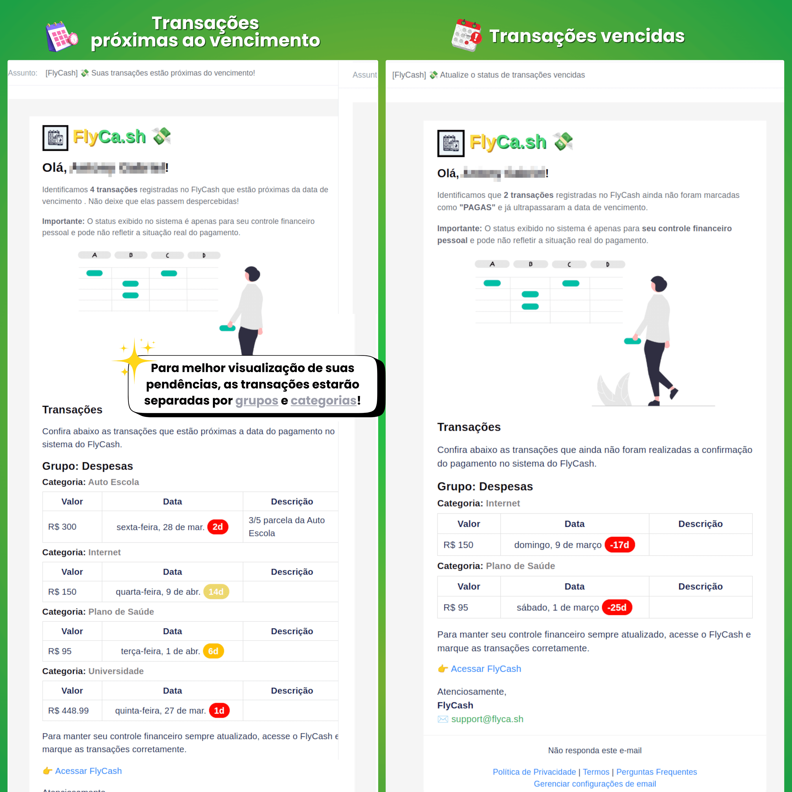

## 📅 Transações

Transações são movimentações financeiras registradas no FlyCash, podendo representar tanto despesas quanto receitas.

### **Criando uma Transação**

1. Selecione um mês de referência em uma categoria.
2. Clique no botão **`Adicionar Transação`**.
3. Preencha os campos obrigatórios **`Data`**, **`Valor`** e opcionalmente **`Descrição`**.
4. Clique em **`Salvar`**.

## **Gerenciando Transações**

### **1. Alteração de Transações**

> [!NOTE]
> Para transações recorrentes, você pode escolher como a alteração será aplicada à série.
> Saiba mais sobre [**recorrência de transações**](/features/transactions-recurrences).

Todos os campos podem ser editados conforme necessário.

### **2. Exclusão de Transações**

A exclusão de transações é permanente e não pode ser desfeita. Para confirmar a remoção, clique em **`Salvar alterações`**.

## **Gerenciando o Status da Transação**

Acompanhe o progresso de suas movimentações alterando o status da transação:

- **Paga**: Indica que a transação já foi concluída.
- **Pendente/Atrasada**: Indica que a transação ainda não foi confirmada como paga.

Além disso, é possível configurar **lembretes de pagamento** para receber notificações por e-mail.

## **Lembretes de Pagamento**

> [!IMPORTANT]
> Essa configuração define o lembrete individualmente para cada transação.
>
> Para ativar ou desativar os lembretes gerais, acesse [**Meu Perfil**](https://flyca.sh/profile) > **Configurações** > **Recebimento de E-mails**.

O FlyCash permite configurar lembretes automáticos para manter suas finanças organizadas e evitar atrasos.

### **Como configurar um lembrete de pagamento**

1. Selecione o mês de referência em uma categoria.
2. Localize a transação desejada.
3. Clique no botão **`Configuração`** e defina **`Lembrete de pagamento`** (**Sim/Não**).
4. Confirme e clique em **`Salvar`**.

Se ativado, o FlyCash enviará um lembrete próximo ao vencimento e caso a transação permaneça pendente após a data de pagamento.

---

Essa página fornece uma visão geral sobre as transações no FlyCash e como gerenciá-las de forma eficiente. Para mais detalhes, explore outras seções da documentação.

